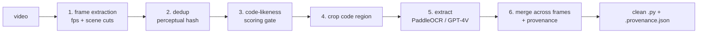

# video-code-extractor (`vce`)

Extract clean, **provenance-tracked** source code from programming-screencast videos
(lecture recordings where code flashes on screen occasionally).

Naïvely OCR-ing every frame produces garbage — duplicates, cursor artifacts, line-number
noise, autocomplete popups, and hallucinated code. `vce` instead runs a staged pipeline:
detect candidate frames → keep only code-bearing ones → crop the code region → OCR / vision
extract → merge overlapping snippets across time → emit a clean script **plus a sidecar
JSON** that records, for every line, the timestamp and screenshot it came from.

See [`docs/architecture.md`](docs/architecture.md) for the full design and prior-art survey.

## Pipeline



## Status

Early scaffolding. Stages are tracked as GitHub issues under the project epic; the shared
types (`vce.types`) and the `ExtractionBackend` protocol (`vce.backends.base`) are in place.
The stages are now wired end-to-end behind the `vce extract` command.

## Usage

```bash
vce extract LESSON.mp4 --out build/        # -> build/LESSON.py + build/LESSON.provenance.json
```

Frames are sampled (`--fps`, plus scene cuts) → de-duplicated → optionally cropped
(`--crop X,Y,W,H`) → transcribed by the **cheap** backend → gated for code-likeness
(`--score-threshold`) → merged into a clean script plus a provenance sidecar. The
code-likeness gate scores a frame *from its transcription*, so it necessarily runs **after** the
cheap backend reads each kept frame — it filters non-code frames out of the merge and the
expensive vision tier, but does not avoid the cheap OCR pass itself.

The `--backend` flag picks the primary (cheap) backend; with `paddleocr` selected, frames it reads
with low confidence are escalated to the vision backend (`--escalate-below`, needs
`OPENAI_API_KEY`; disable with `--no-escalate`). Intermediate frames and crops are written to
per-video `<video>_frames` / `<video>_crops` sub-directories of `--out`.

> The default `paddleocr` backend lives in the optional `paddle` extra, so a bare install must
> first run `uv sync --extra paddle` (or `pip install 'video-code-extractor[paddle]'`).
> Alternatively, run fully on the vision backend with `--backend vision-gpt4v` and `OPENAI_API_KEY`
> set — no extra required.

## Develop

```bash
uv sync --dev              # install deps + dev tools
uv run pytest -m "not paddle"
uv run ruff check .
uv run ruff format --check .
```

PaddleOCR is an optional, heavy extra: `uv sync --extra paddle` and run `pytest -m paddle`.

## Downloading the source course (separate tool)

[`tools/download_lessons.py`](tools/download_lessons.py) is the standalone script that
fetches the DeepLearning.AI JAX lessons used during development. Course videos are
git-ignored (`*.mp4`) and never committed.
