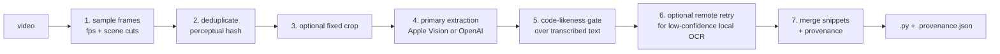

# video-code-extractor (`vce`)

`vce` extracts best-effort, provenance-tracked source code from programming-screencast videos.
It samples candidate frames, removes near-duplicates, transcribes likely code with Apple Vision or
an OpenAI vision model, and merges overlapping snippets into a Python file plus an audit sidecar.

## Status

The original [pipeline epic](https://github.com/pavelkrotkov/video-code-extractor/issues/2) is
complete, and all stages are wired end-to-end behind `vce extract`.

This is still an early-quality MVP, not a production-ready code recovery tool. Real-course
verification has found lost indentation, notebook output admitted as code, OCR corruption, and
duplicate overlapping snippets; some generated Python does not compile. Those gaps are tracked in
[issue #24](https://github.com/pavelkrotkov/video-code-extractor/issues/24). Always inspect the
generated script against its screenshots and raw OCR before using it.

The provenance JSON contains one entry per retained frame extraction, not per generated source
line. Each entry records the timestamp, screenshot path, raw OCR, and merged code associated with
that extraction.

## Requirements and setup

- Python 3.10 or newer
- [`uv`](https://docs.astral.sh/uv/)
- `ffmpeg` on `PATH`
- macOS for local Apple Vision OCR, or an `OPENAI_API_KEY` for remote extraction

Install the project and its development dependencies:

```bash
uv sync --dev
```

Run commands through `uv run`; a separate global installation of `vce` is not required.

## Run the complete pipeline

Local Apple Vision OCR on macOS, with no remote calls:

```bash
uv run vce extract LESSON.mp4 \
  --backend macos-vision \
  --no-escalate
```

On macOS, the default backend is `macos-vision`. If `OPENAI_API_KEY` is present, low-confidence
local extractions are automatically retried with the remote vision backend:

```bash
export OPENAI_API_KEY=...
uv run vce extract LESSON.mp4
```

On non-macOS systems, use the remote backend for the whole run:

```bash
export OPENAI_API_KEY=...
uv run vce extract LESSON.mp4 --backend vision-gpt4v
```

Remote extraction uses the OpenAI API and may incur usage charges. The key is read only from the
environment; there is deliberately no command-line key option.

Output lands in `out/` by default (gitignored). For `LESSON.mp4`:

```text
out/
├── LESSON.py                  # merged, best-effort code
├── LESSON.provenance.json     # extraction-level audit records
├── LESSON_frames/             # sampled and scene-change frames
└── LESSON_crops/              # present when --crop is used
```

The command prints a `[1/5] … [5/5]` stage header with a tqdm progress bar for each stage, then
a stats block:

```
  Frames extracted:         120
  After dedup:               87  (27% removed)
  Passed scoring gate:       54  (62%)
  Escalated:                  8
  Snippets merged:           21
  Output:  out/LESSON.py
    lines: 312   chars: 9847
  Time: 1m 43s
```

See every supported option with:

```bash
uv run vce extract --help
```

The most useful options are:

| Option | Meaning |
| --- | --- |
| `--out DIR` | Output directory; default `out/` |
| `--fps FLOAT` | Regular frame sampling rate; default `1.0` |
| `--scene-threshold FLOAT` | ffmpeg scene-change sensitivity; default `0.3` |
| `--crop X,Y,W,H` | Fixed pixel region sent to the extraction backend |
| `--score-threshold FLOAT` | Minimum code-likeness score retained for merging; default `0.4` |
| `--escalate-below FLOAT` | Retry local OCR remotely below this confidence; default `0.6` |
| `--no-escalate` | Guarantee a local-only run when using `macos-vision` |

## Actual pipeline order



The code-likeness gate runs after primary extraction because it scores transcribed text. It avoids
remote escalation and merging for rejected frames, but it cannot avoid the initial OCR pass.

The implementation and configuration live in
[`src/vce/pipeline.py`](src/vce/pipeline.py). The original design and prior-art survey are in
[`docs/architecture.md`](docs/architecture.md); that document is background material rather than a
current usage guide.

## Run stages individually

There are currently no per-stage CLI subcommands. The stages are importable Python APIs intended
for tests, experiments, and custom pipelines:

| Stage | Public API |
| --- | --- |
| Frame sampling and scene cuts | `vce.frames.extract_frames`, `vce.frames.scene_change_frames` |
| Perceptual deduplication | `vce.dedup.dedup_frames` |
| Fixed-region cropping | `vce.cropping.crop_region` |
| Local OCR | `vce.backends.macos_vision.MacOSVisionBackend` |
| Remote extraction | `vce.backends.vision.VisionLLMBackend` |
| Code-likeness scoring | `vce.scoring.score_code_likeness` |
| Snippet merging and provenance | `vce.merge.merge_results`, `vce.merge.build_provenance`, `vce.merge.write_provenance` |
| End-to-end orchestration | `vce.pipeline.Pipeline`, `PipelineConfig` |

For example, this runs only frame collection and deduplication:

```python
from pathlib import Path

from vce.dedup import dedup_frames
from vce.frames import extract_frames, scene_change_frames

video = Path("LESSON.mp4")
out = Path("build/manual_frames")

frames = [
    *extract_frames(video, out, fps=1.0),
    *scene_change_frames(video, out, threshold=0.3),
]
frames.sort(key=lambda frame: (frame.timestamp_ms, str(frame.path)))
kept = dedup_frames(frames, max_distance=4)

for frame in kept:
    print(frame.timestamp_ms, frame.path)
```

Save it as a Python file and run it in the project environment:

```bash
uv run python my_stage_experiment.py
```

## Auxiliary tools

### Backend benchmark

The committed fixture benchmark directly invokes the real Apple Vision and OpenAI backends:

```bash
uv run python -m vce.bench
```

It is not a `vce` subcommand and currently accepts no command-line options. When OpenAI credentials
are available it may make remote API calls.

### Course downloader

[`tools/download_lessons.py`](tools/download_lessons.py) is a separate, uv-compatible script used
to fetch DeepLearning.AI lessons during development:

```bash
uv run tools/download_lessons.py <COURSE_URL>
```

It is not part of the extraction pipeline. `ffmpeg` is required. Authentication must be configured
in the script from a valid browser session.

**What it does:**

1. Scrapes the course page for lesson URLs and extracts the HLS `.m3u8` stream from each.
2. Stream-copies each lesson to `raw/lesson_NN_<slug>.mp4` (gitignored), printing a live ffmpeg
   progress line per lesson.
3. After all downloads complete, merges the lessons into a single `raw/<course-slug>.mp4`:
   - If all lessons share the same video dimensions, the merge is a lossless stream-copy
     (concat demuxer, no re-encode).
   - If dimensions differ (e.g. landscape intro + square-framed body lessons), the script
     re-encodes every clip with `scale`+`pad` to the largest bounding box and concatenates
     with the `libx264`/`aac` codec pair.
4. Prints a final stats line: number of lessons, total size, and duration of the merged file.

Pass `--no-merge` to keep individual lesson files and skip the merge step. The merge is also
skipped automatically if any lesson failed to download, to avoid producing an incomplete file.

```
Downloaded 12 lesson(s) (1.4 GB total)
Merged: raw/build-and-train-an-llm-with-jax.mp4 (1.4 GB, 2h 7m)
```

## Develop

```bash
uv sync --dev
uv run pytest -m "not macos"
uv run ruff check .
uv run ruff format --check .
```

The `macos`-marked test exercises real Apple Vision OCR:

```bash
uv run pytest -m macos
```

It runs only on macOS and skips elsewhere. The remaining suite uses injected OCR annotations and
does not require real course videos.
